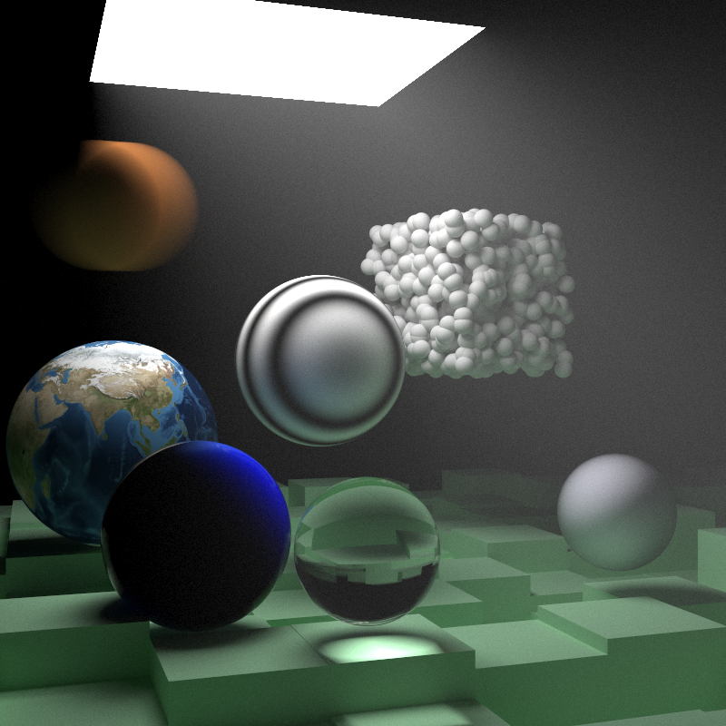

## Ray Tracer

This is a simple ray tracer written in Rust.
It's based on the [Ray Tracing in One Weekend series](https://raytracing.github.io/).

I did this mostly as a way to practice Rust,
but also because I have a thing for graphics programming,
and I though it'd be fun.

## How to run

Check out the repo and run it locally using Cargo.

You'll need to pass in a few arguments:

```sh
# Determines the quality of the render.
# The higher the number, the better the quality and higher the resolution,
# but the longer it'll take to render.
-q / --quality [0~7]
```

```sh
# Determines which scene to render.
# All scenes are preprogrammed (for now).
-s / --scene [0~8]
# 0 - bouncing balls scene
# 1 - 3D textured balls scene
# 2 - Planets scene
# 3 - Perlin noise balls scene
# 4 - Perlin noise balls with lights scene
# 5 - Quads scene
# 6 - Cornell Box scene
# 7 - Cornell Smoke Box scene
# 8 - Fancy scene with all features
```

The application itself just pipes the output pixel data straight to `stdout`.
You'll likely want to capture it into a file and convert that data into an image.
That'll usually look something like this:

```sh
cargo run --release -- -s 8 -q 2 > image.ppm && ffmpeg -i image.ppm image.png
```

Then you can view the image however you like:

```sh
feh image.png
```


